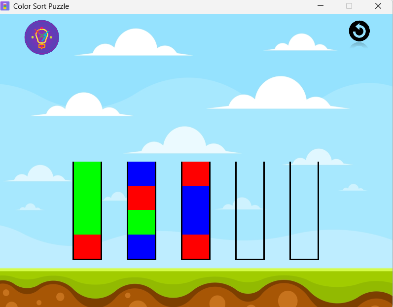

# 🧪 Color Sort Puzzle Game

A fun and challenging 2D puzzle game built in C++ using SFML where players sort colored liquids in test tubes. The objective is to organize the liquids so that each tube contains only one color.

## 🎮 Game Features

- 🎨 Intuitive color sorting puzzle mechanics
- 🖱️ Mouse-based interaction
- 🔊 Engaging sound effects and background music
- 🧫 Multiple tubes filled with randomly mixed colored liquids
- 🏁 Win condition detection
- 🔢 Move counter to track player progress
- 🤖 Auto-solver using BFS (Breadth-First Search)
- 🖼️ Clean and responsive UI with animated interactions

## ⚙️ Prerequisites

To build and run this game, you need:

- 🧰 C++ Compiler (GCC 13.1.0 recommended)
- 📦 SFML 2.6.2 or later

## 🛠️ Building the Project

### Manual Compilation (GCC)
```bash
g++ main.cpp Tube.cpp Game.cpp Homepage.cpp Autosolver.cpp Resources/Images/icon.res -o ColorSortGame ^
-IC:/SFML-2.6.2-gcc-13.1.0_32/SFML-2.6.2/include ^
-LC:/SFML-2.6.2-gcc-13.1.0_32/SFML-2.6.2/lib ^
-lsfml-graphics -lsfml-window -lsfml-system -lsfml-audio
```

## 🕹️ How to Play

1. 🧪 Click on a tube to select it
2. 🧪 Click on another tube to transfer the top liquid layer
3. ✅ Arrange all colors into separate tubes to win the game

## 📏 Game Rules

- 🔄 Only the topmost liquid layer can be transferred
- 📥 Can only pour onto an empty tube or a tube with the same color on top
- 🧪 Each tube can hold up to 4 liquid units
- 🎉 The game ends when all colors are sorted correctly

## 🎛️ Controls

- 🖱️ **Left Mouse Click**: Select tube / Transfer liquid
- 🤖 **Auto Solve Button**: Trigger auto-solver (BFS algorithm)
- ❌ **Close Window Button**: Exit the game

## 🧩 Dependencies

- 🛠️ SFML 2.6.2 (Simple and Fast Multimedia Library)
  - 🖼️ Graphics module
  - 🪟 Window module
  - 🧠 System module
  - 🔉 Audio module

## 🧠 Development Notes

The game uses:
- 🧱 Custom `ColorStack` class for managing liquid layers
- 🧪 `TestTube` class to represent and draw each tube
- 🎮 `Game` class to manage game state and logic
- 🤖 `AutoSolver` module that uses BFS to solve the puzzle
- 🔄 Event-driven game loop using SFML

## 🚀 Future Improvements


- 🗂️ Implement level selection UI
- 💧 Enhance liquid transfer animations
- 🏆 Add scoring and leaderboard system
- 🧰 Introduce a level editor for custom puzzles
- 💾 Enable saving and loading of game progress
- 📱 Mobile version with touch support

## 👨‍💻 Author

### **Varun Kumar**

Enjoy playing and sorting! 🎉🧪

## 📸 Screenshots




